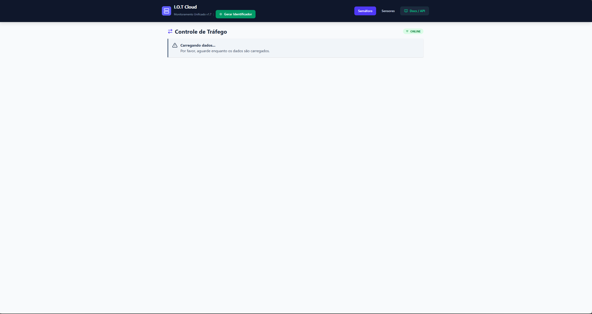
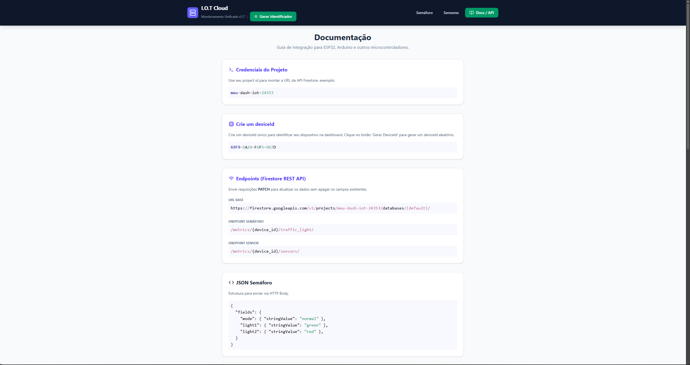
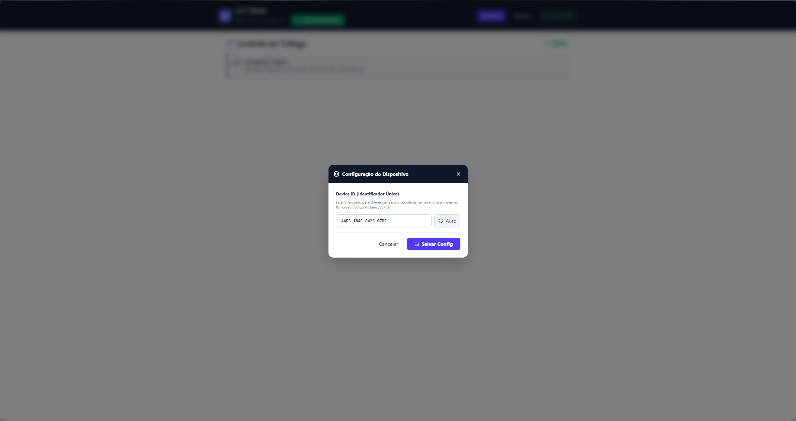
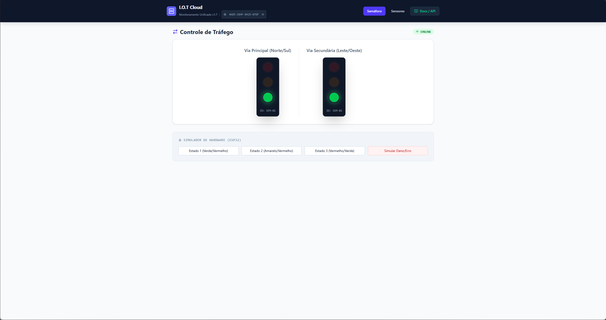
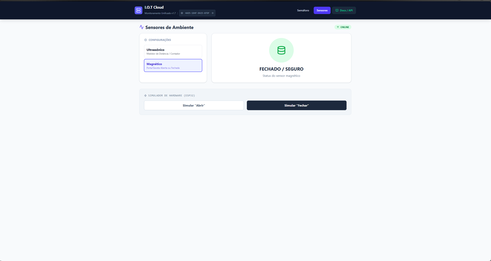
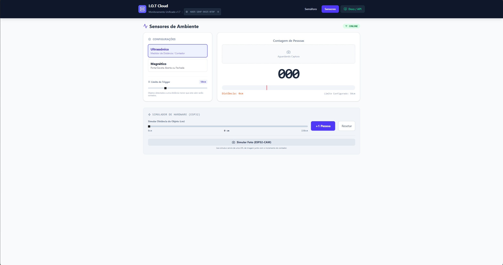

# 🌐 I.O.T Cloud - Hardware Hub


**I.O.T Cloud** is a modern, responsive web dashboard designed for real-time monitoring and simulation of IoT hardware. Built with React 19 and Firebase, it provides a seamless interface for developers to track sensor data and control traffic light systems from anywhere in the world.

---

## ✨ Key Features

### 🚦 Real-time Traffic Monitoring
* **Live Status**: View the current state of traffic signals (`Green`, `Yellow`, `Red`).
* **Multi-Device Support**: Track multiple devices or groups with low latency.
* **Status Badges**: Instant visual feedback on device connectivity and mode.

### 🛰️ Advanced Sensor Hub
* **Dual-Mode support**: Specifically optimized for Ultrasonic and Magnetic sensors.
* **Metrics Tracking**: Monitor distances (cm), occupancy counts, and door states (open/closed).
* **Live Updates**: High-frequency data synchronization via Firestore.

### 🛠️ Integrated Hardware Simulator
* **Web-based ESP32 Simulator**: Test your dashboard logic without needing physical hardware.
* **Interactive Controls**: Simulate object proximity or door triggers directly from the UI.
* **Instant Logic Validation**: Debug your backend integration in real-time.

### 📚 Developer Documentation & API
* **Built-in Guide**: Comprehensive documentation for integrating ESP32 and Arduino.
* **Code Snippets**: Ready-to-copy C++ examples using `HTTPClient`.
* **REST API Specs**: Clear JSON structure guides for Firestore REST API integration.

---

## ▶️Screenshots

Here are some screenshots of the I.O.T Cloud dashboard in action:

### Dashboard Overview


### Traffic Light Monitoring


### Sensor Data Display


### Hardware Simulator


### API Documentation


### Mobile Responsive View


---

## 🚧Tech Stack

- **Framework**: [React 19](https://react.dev/)
- **Build Tool**: [Vite](https://vitejs.dev/)
- **Language**: [TypeScript](https://www.typescriptlang.org/)
- **Styling**: [Tailwind CSS 4.0](https://tailwindcss.com/)
- **Icons**: [Lucide React](https://lucide.dev/)
- **Backend / Database**: [Firebase](https://firebase.google.com/) (Auth & Firestore)
- **Validation**: [Zod](https://zod.dev/) & [React Hook Form](https://react-hook-form.com/)

---

## 🛠️ Getting Started

### Prerequisites
- Node.js (v18 or higher)
- npm or yarn
- A Firebase project

### Installation

1. **Clone the repository**
   ```bash
   git clone https://github.com/gabriel-oliveira800/dash-iot
   cd dash-iot
   ```

2. **Install dependencies**
   ```bash
   npm install
   ```

3. **Environment Setup**
   Create a `.env` file in the root directory and add your Firebase credentials:
   ```env
   VITE_FIREBASE_API_KEY=your_api_key
   VITE_FIREBASE_AUTH_DOMAIN=your_auth_domain
   VITE_FIREBASE_PROJECT_ID=your_project_id
   VITE_FIREBASE_STORAGE_BUCKET=your_storage_bucket
   VITE_FIREBASE_MESSAGING_SENDER_ID=your_sender_id
   VITE_FIREBASE_APP_ID=your_app_id
   ```

4. **Start Development Server**
   ```bash
   npm run dev
   ```

---

## 📖 Usage Guide

### 1. Monitoring Traffic Lights
Navigate to the **Semáforo** tab to see real-time lights and device status. The UI updates instantly when the Firestore document changes.

### 2. Sensor Management
In the **Sensores** tab, switch between different sensor types (Ultrasonic/Magnetic) to see specific metrics like distance or trip counts.

### 3. Simulation Mode
Use the **Simulador de Hardware** section at the bottom of the sensor pages to "fake" hardware events. This is perfect for testing the UI response before deploying code to an actual ESP32.

### 4. API Integration
The **Docs / API** tab contains everything you need to connect your physical device, including the base URL and the correct JSON body format for `PATCH` requests.

---

## 📄 License

This project is open-source. Feel free to use and modify it for your own IoT projects!

---

Developed with ❤️ for the IoT community.
